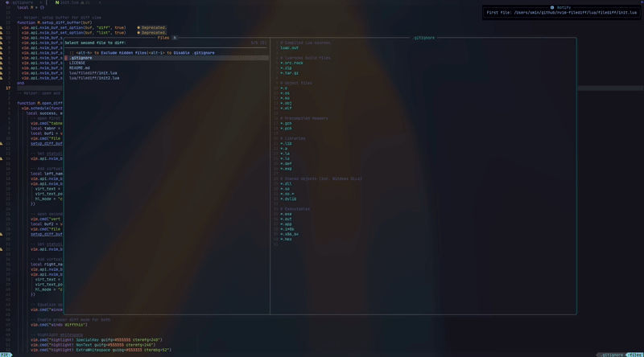

# Neovim FileDiff

A lightweight Neovim plugin to quickly diff two files or two folders using Neovim’s built-in :diffthis.
Powered by fzf-lua for file selection (optional).

✨ Features
🔍 Diff two files with fuzzy file picker
⌨️ Enter two paths manually and diff them
📂 Diff entire folders (all files side by side)

Using Lazy.nvim:

```lua
return {
  "sminrana/nvim-filediff",
  event = "VeryLazy", -- ensures keymaps load
  config = function()
    local filediff = require("filediff")

      vim.keymap.set("n", "<leader>fd", "<cmd>FileDiff<CR>", { desc = "Diff two files" })
      vim.keymap.set("n", "<leader>fi", "<cmd>FileDiffInput<CR>", { desc = "Diff via input paths" })
      vim.keymap.set("n", "<leader>fo", "<cmd>FolderDiff<CR>", { desc = "Diff two folders" })
  end,
}
```

🔌 Optional dependency
fzf-lua — for fuzzy file selection
(If not installed, the plugin falls back to vim.ui.input prompts.)

⌨️ Keymaps Mapping Action

- <leader>fd Diff two files (fzf picker)
- <leader>fi Diff two files (manual input)
- <leader>fo Diff two folders

🚀 Usage

- Press <leader>fd → Select first file → Select second file → Diff opens in splits
- Press <leader>fi → Type two file paths → Diff opens
- Press <leader>fo → Pick two folders → Diff all common files

📸 Demo

Watch the demo on YouTube (https://youtu.be/7AJyT7ThS18)



⚡ Roadmap

- Highlight added/removed lines with better colors

📝 License
MIT License © 2025 sminrana
